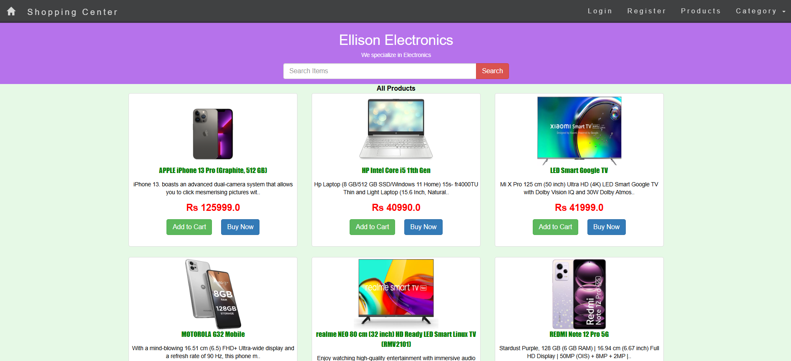
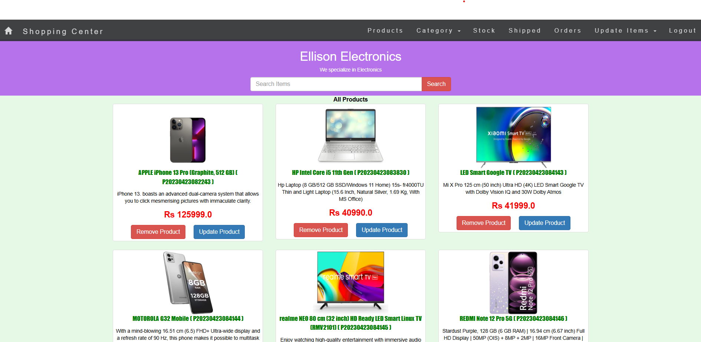
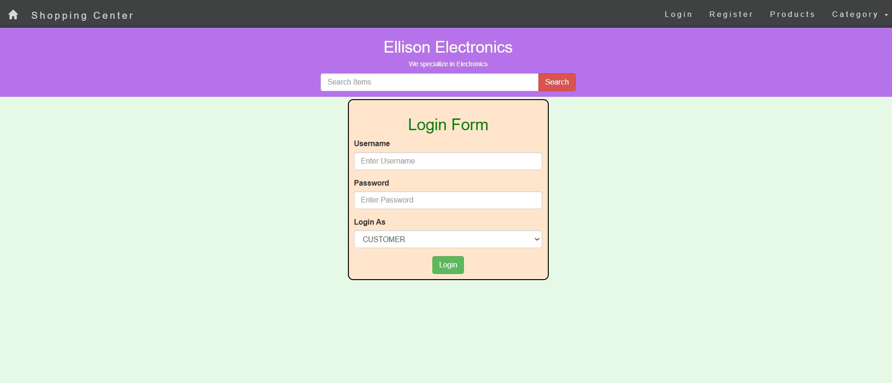
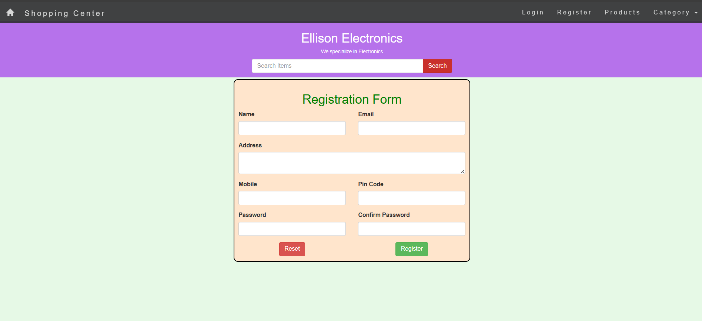

# Online Shopping Cart (E-Commerce Website)
- The Online Shopping Cart is a full-featured e-commerce web application designed to provide a seamless shopping experience for users while enabling 	businesses to showcase and sell their products online.
---
#### Some Screenshots for the project:
<table>
  <tr>
    <td align="center">Home Page<br></td>
    <td align="center">Admin Home<br></td>
  </tr>
</table>

<table>
  <tr>
    <td align="center">Login Page<br></td>
    <td align="center">Register Page<br></td>
  </tr>
</table>

---

### The users will get a mail to their registered mail Id during:-
- New User Registration
- Order Successfully Placed
- The Item was out of stock while exploring but now it got available in the store
- Successful shipment and delivery of the Item

### Technologies used:-
1. Front-End Development:
- HTML
- CSS
- Javascript
- BootStrap

2. Back-End Development:
- Java [JDK 8+]
- JDBC
- Servlet
- JSP

3. Database:
- MySql

---
### Dummy Database Initialization 
- 1: Open MySQL Command Prompt or MySQL Workbench
- 2: Login to the administrator user of MySql:
	 ```mysql -u <username> -p``` (Enter Password if asked)
- 3: Copy paste and execute the MySQL Query from the following file:-
- Run the Sql Query From this file: [databases/mysql_query.sql](./databases/mysql_query.sql-## GMAIL APP PASSWORD [For Mailing Functionalities]
---
### GMAIL APP PASSWORD [For Mailing Functionalities]
- 1: Create a gmail account or login to existing account in any browser
- 2 : Go to [https://myaccount.google.com/security](https://myaccount.google.com/security) and check if 2 step verifications is enabled or not, enable it if not enabled
- 3: Go to [https://myaccount.google.com/apppasswords](https://myaccount.google.com/apppasswords) and enter password if asked
- 4: In Select an App Section: select Other (custom name) => enter "Ellison Electronics" => Generate
- 5: After that it will generate 16 digits app password which you need to copy and save for future configurations.
- 6: Done : Now continue to importing the project. [Don't share the above password generated to anyone]

---
### How to Access:
- Check Running The Site At  [http://localhost:8000/shop/](http://localhost:8000/shop/)
- Default Username And Password For Admin Is "admin@gmail.com" And "admin"
- The default Username And Password For User Is "guest@gmail.com" And "guest"

---


